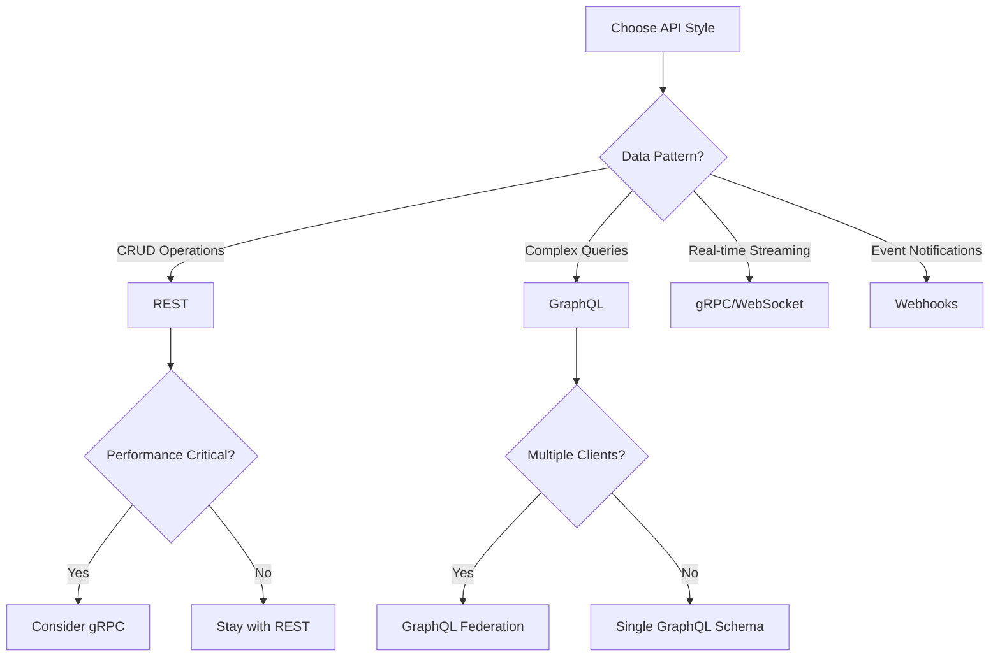

# API Architecture

A comprehensive guide to understanding the architectural principles, patterns, and design decisions behind modern API systems.

## Table of Contents

1. [Introduction](#introduction)
2. [Architectural Styles](#architectural-styles)
3. [RESTful Architecture](#restful-architecture)
4. [GraphQL Architecture](#graphql-architecture)
5. [gRPC and Protocol Buffers](#grpc-and-protocol-buffers)
6. [Event-Driven Architecture](#event-driven-architecture)
7. [Microservices Architecture](#microservices-architecture)
8. [API Gateway Pattern](#api-gateway-pattern)
9. [Service Mesh Architecture](#service-mesh-architecture)
10. [Security Architecture](#security-architecture)
11. [Scalability Patterns](#scalability-patterns)
12. [Data Architecture](#data-architecture)
13. [Caching Strategies](#caching-strategies)
14. [Version Management](#version-management)
15. [Monitoring and Observability](#monitoring-and-observability)

## Introduction

API architecture defines the structural design of application programming interfaces, encompassing the principles, patterns, and practices that guide how APIs are built, deployed, and maintained. A well-designed API architecture ensures scalability, maintainability, security, and optimal performance.

### Key Architectural Principles

1. **Separation of Concerns**: Isolate different aspects of functionality
2. **Loose Coupling**: Minimize dependencies between components
3. **High Cohesion**: Group related functionality together
4. **Scalability**: Design for growth from the start
5. **Resilience**: Build fault-tolerant systems
6. **Security by Design**: Embed security at every layer

## Architectural Styles

### Comparison of API Architectural Styles

| Style | Use Case | Pros | Cons |
|-------|----------|------|------|
| **REST** | Web services, CRUD operations | Simple, stateless, cacheable | Over/under-fetching, multiple requests |
| **GraphQL** | Complex data requirements | Flexible queries, single endpoint | Complexity, caching challenges |
| **gRPC** | Microservices, real-time | High performance, streaming | Browser support, debugging |
| **SOAP** | Enterprise, transactions | Standards-based, security | Complexity, verbosity |
| **WebSocket** | Real-time, bi-directional | Low latency, persistent | Scaling challenges |
| **Webhook** | Event notifications | Real-time, efficient | Reliability, security |

### Decision Matrix



## RESTful Architecture

### REST Principles

REST (Representational State Transfer) is an architectural style that defines constraints for creating web services:

1. **Client-Server Architecture**: Separation of concerns between UI and data storage
2. **Statelessness**: Each request contains all information needed
3. **Cacheability**: Responses must define themselves as cacheable or non-cacheable
4. **Uniform Interface**: Standardized communication between components
5. **Layered System**: Hierarchical layers with defined responsibilities
6. **Code on Demand** (optional): Server can extend client functionality

### RESTful API Design

```yaml
# RESTful Resource Design
/api/v1/
  /users/                    # Collection
    GET                      # List users
    POST                     # Create user
    /users/{id}/            # Resource
      GET                    # Get user
      PUT                    # Update user
      PATCH                  # Partial update
      DELETE                 # Delete user
      /users/{id}/orders/   # Sub-resource
        GET                  # Get user's orders
        POST                 # Create order for user
```

### REST Implementation Example

```python
# RESTful API Implementation (Python/Flask)
from flask import Flask, jsonify, request
from flask_restful import Api, Resource
import uuid

app = Flask(__name__)
api = Api(app)

class UserResource(Resource):
    def get(self, user_id=None):
        if user_id:
            # Get specific user
            user = database.get_user(user_id)
            if not user:
                return {'error': 'User not found'}, 404
            return user.to_dict(), 200
        else:
            # List all users
            users = database.get_all_users()
            return {
                'users': [u.to_dict() for u in users],
                'total': len(users)
            }, 200
    
    def post(self):
        # Create new user
        data = request.get_json()
        
        # Validate input
        if not self.validate_user_data(data):
            return {'error': 'Invalid data'}, 400
        
        # Create user
        user = User(
            id=str(uuid.uuid4()),
            **data
        )
        database.save_user(user)
        
        # Return created resource
        return user.to_dict(), 201, {
            'Location': f'/api/v1/users/{user.id}'
        }
    
    def put(self, user_id):
        # Full update
        user = database.get_user(user_id)
        if not user:
            return {'error': 'User not found'}, 404
        
        data = request.get_json()
        user.update_all(data)
        database.save_user(user)
        
        return user.to_dict(), 200
    
    def patch(self, user_id):
        # Partial update
        user = database.get_user(user_id)
        if not user:
            return {'error': 'User not found'}, 404
        
        data = request.get_json()
        user.update_partial(data)
        database.save_user(user)
        
        return user.to_dict(), 200
    
    def delete(self, user_id):
        # Delete user
        if not database.delete_user(user_id):
            return {'error': 'User not found'}, 404
        
        return '', 204

# Register routes
api.add_resource(UserResource, 
    '/api/v1/users',
    '/api/v1/users/<string:user_id>')
```

### HATEOAS (Hypermedia as the Engine of Application State)

```json
{
  "user": {
    "id": "123",
    "name": "John Doe",
    "email": "john@example.com",
    "_links": {
      "self": {
        "href": "/api/v1/users/123"
      },
      "orders": {
        "href": "/api/v1/users/123/orders"
      },
      "addresses": {
        "href": "/api/v1/users/123/addresses"
      },
      "update": {
        "href": "/api/v1/users/123",
        "method": "PUT"
      },
      "delete": {
        "href": "/api/v1/users/123",
        "method": "DELETE"
      }
    }
  }
}
```

## GraphQL Architecture

### GraphQL Principles

GraphQL is a query language and runtime for APIs that provides:

1. **Single Endpoint**: All requests go to one URL
2. **Type System**: Strongly typed schema definition
3. **Client-Specified Queries**: Clients request exactly what they need
4. **Hierarchical**: Follows relationships between types
5. **Introspective**: Schema is queryable

### GraphQL Schema Definition

```graphql
# GraphQL Schema
type Query {
  user(id: ID!): User
  users(filter: UserFilter, limit: Int = 10): [User!]!
  weather(location: String!): Weather
}

type Mutation {
  createUser(input: CreateUserInput!): User!
  updateUser(id: ID!, input: UpdateUserInput!): User!
  deleteUser(id: ID!): Boolean!
}

type Subscription {
  weatherUpdates(location: String!): Weather!
  userStatusChanged(userId: ID!): User!
}

type User {
  id: ID!
  name: String!
  email: String!
  createdAt: DateTime!
  orders: [Order!]!
  address: Address
}

type Order {
  id: ID!
  user: User!
  items: [OrderItem!]!
  total: Float!
  status: OrderStatus!
  createdAt: DateTime!
}

enum OrderStatus {
  PENDING
  PROCESSING
  SHIPPED
  DELIVERED
  CANCELLED
}

input CreateUserInput {
  name: String!
  email: String!
  password: String!
}

input UserFilter {
  name: String
  email: String
  createdAfter: DateTime
}
```

### GraphQL Resolver Implementation

```javascript
// GraphQL Resolvers (Node.js/Apollo)
const { ApolloServer, gql } = require('apollo-server');
const { GraphQLScalarType } = require('graphql');

const resolvers = {
  Query: {
    user: async (parent, { id }, context) => {
      // Check authentication
      if (!context.user) {
        throw new Error('Unauthorized');
      }
      
      // Fetch user
      const user = await context.dataSources.userAPI.getUser(id);
      if (!user) {
        throw new Error('User not found');
      }
      
      return user;
    },
    
    users: async (parent, { filter, limit }, context) => {
      return context.dataSources.userAPI.getUsers(filter, limit);
    },
    
    weather: async (parent, { location }, context) => {
      return context.dataSources.weatherAPI.getWeather(location);
    }
  },
  
  Mutation: {
    createUser: async (parent, { input }, context) => {
      // Validate input
      await validateUserInput(input);
      
      // Create user
      const user = await context.dataSources.userAPI.createUser(input);
      
      // Send welcome email
      await context.services.emailService.sendWelcomeEmail(user);
      
      return user;
    },
    
    updateUser: async (parent, { id, input }, context) => {
      // Check authorization
      if (context.user.id !== id && !context.user.isAdmin) {
        throw new Error('Forbidden');
      }
      
      return context.dataSources.userAPI.updateUser(id, input);
    }
  },
  
  Subscription: {
    weatherUpdates: {
      subscribe: (parent, { location }, context) => {
        return context.pubsub.asyncIterator([`WEATHER_${location}`]);
      }
    }
  },
  
  User: {
    orders: async (user, args, context) => {
      // Resolve orders for user (N+1 query problem solution)
      return context.loaders.orderLoader.load(user.id);
    },
    
    address: async (user, args, context) => {
      return context.dataSources.addressAPI.getAddress(user.addressId);
    }
  }
};

// DataLoader for batch loading (N+1 query optimization)
const DataLoader = require('dataloader');

const createOrderLoader = () => new DataLoader(async (userIds) => {
  const orders = await db.query(
    'SELECT * FROM orders WHERE user_id IN (?)',
    [userIds]
  );
  
  // Group orders by user_id
  const ordersByUser = {};
  orders.forEach(order => {
    if (!ordersByUser[order.user_id]) {
      ordersByUser[order.user_id] = [];
    }
    ordersByUser[order.user_id].push(order);
  });
  
  // Return in same order as userIds
  return userIds.map(id => ordersByUser[id] || []);
});
```

## gRPC and Protocol Buffers

### gRPC Architecture

gRPC is a high-performance, open-source RPC framework that uses Protocol Buffers for serialization.

### Protocol Buffer Definition

```protobuf
// weather.proto
syntax = "proto3";

package weather;

service WeatherService {
  // Unary RPC
  rpc GetCurrentWeather (LocationRequest) returns (WeatherResponse);
  
  // Server streaming RPC
  rpc GetWeatherUpdates (LocationRequest) returns (stream WeatherResponse);
  
  // Client streaming RPC
  rpc ReportWeatherData (stream WeatherReport) returns (WeatherSummary);
  
  // Bidirectional streaming RPC
  rpc WeatherChat (stream WeatherMessage) returns (stream WeatherMessage);
}

message LocationRequest {
  oneof location {
    string city = 1;
    Coordinates coordinates = 2;
  }
  
  enum Units {
    METRIC = 0;
    IMPERIAL = 1;
    KELVIN = 2;
  }
  
  Units units = 3;
}

message Coordinates {
  double latitude = 1;
  double longitude = 2;
}

message WeatherResponse {
  string location = 1;
  double temperature = 2;
  double humidity = 3;
  Wind wind = 4;
  repeated Condition conditions = 5;
  int64 timestamp = 6;
}

message Wind {
  double speed = 1;
  int32 direction = 2;
}

message Condition {
  string main = 1;
  string description = 2;
  string icon = 3;
}

message WeatherReport {
  string station_id = 1;
  WeatherResponse data = 2;
}

message WeatherSummary {
  int32 reports_received = 1;
  map<string, double> average_temperatures = 2;
}
```

### gRPC Server Implementation

```python
# gRPC Server (Python)
import grpc
from concurrent import futures
import weather_pb2
import weather_pb2_grpc
import time

class WeatherService(weather_pb2_grpc.WeatherServiceServicer):
    
    def GetCurrentWeather(self, request, context):
        # Unary RPC
        location = self.extract_location(request)
        weather_data = self.fetch_weather_data(location)
        
        return weather_pb2.WeatherResponse(
            location=location,
            temperature=weather_data['temperature'],
            humidity=weather_data['humidity'],
            wind=weather_pb2.Wind(
                speed=weather_data['wind_speed'],
                direction=weather_data['wind_direction']
            ),
            conditions=[
                weather_pb2.Condition(
                    main=c['main'],
                    description=c['description'],
                    icon=c['icon']
                ) for c in weather_data['conditions']
            ],
            timestamp=int(time.time())
        )
    
    def GetWeatherUpdates(self, request, context):
        # Server streaming RPC
        location = self.extract_location(request)
        
        while context.is_active():
            weather_data = self.fetch_weather_data(location)
            
            yield weather_pb2.WeatherResponse(
                location=location,
                temperature=weather_data['temperature'],
                humidity=weather_data['humidity'],
                timestamp=int(time.time())
            )
            
            time.sleep(60)  # Update every minute
    
    def ReportWeatherData(self, request_iterator, context):
        # Client streaming RPC
        reports_count = 0
        temperature_sum = {}
        temperature_count = {}
        
        for report in request_iterator:
            reports_count += 1
            station = report.station_id
            
            if station not in temperature_sum:
                temperature_sum[station] = 0
                temperature_count[station] = 0
            
            temperature_sum[station] += report.data.temperature
            temperature_count[station] += 1
        
        # Calculate averages
        averages = {
            station: temp_sum / temperature_count[station]
            for station, temp_sum in temperature_sum.items()
        }
        
        return weather_pb2.WeatherSummary(
            reports_received=reports_count,
            average_temperatures=averages
        )
    
    def WeatherChat(self, request_iterator, context):
        # Bidirectional streaming RPC
        for message in request_iterator:
            # Process incoming message
            response = self.process_weather_message(message)
            
            # Send response
            yield response

def serve():
    server = grpc.server(futures.ThreadPoolExecutor(max_workers=10))
    weather_pb2_grpc.add_WeatherServiceServicer_to_server(
        WeatherService(), server
    )
    
    # Enable reflection for debugging
    from grpc_reflection.v1alpha import reflection
    reflection.enable_server_reflection(
        (weather_pb2.DESCRIPTOR.services_by_name['WeatherService'].full_name,),
        server
    )
    
    # Add secure port with TLS
    with open('server.key', 'rb') as f:
        private_key = f.read()
    with open('server.crt', 'rb') as f:
        certificate_chain = f.read()
    
    server_credentials = grpc.ssl_server_credentials(
        ((private_key, certificate_chain,),)
    )
    
    server.add_secure_port('[::]:50051', server_credentials)
    server.start()
    server.wait_for_termination()

if __name__ == '__main__':
    serve()
```

## Event-Driven Architecture

### Event-Driven Patterns

Event-driven architecture (EDA) is a design paradigm where services communicate through events.

### Event Bus Architecture

```python
# Event Bus Implementation
import asyncio
from typing import Dict, List, Callable, Any
from dataclasses import dataclass
from datetime import datetime
import json

@dataclass
class Event:
    id: str
    type: str
    timestamp: datetime
    data: Dict[str, Any]
    metadata: Dict[str, Any]

class EventBus:
    def __init__(self):
        self.subscribers: Dict[str, List[Callable]] = {}
        self.middleware: List[Callable] = []
        
    def subscribe(self, event_type: str, handler: Callable):
        """Subscribe to an event type"""
        if event_type not in self.subscribers:
            self.subscribers[event_type] = []
        self.subscribers[event_type].append(handler)
    
    def unsubscribe(self, event_type: str, handler: Callable):
        """Unsubscribe from an event type"""
        if event_type in self.subscribers:
            self.subscribers[event_type].remove(handler)
    
    async def publish(self, event: Event):
        """Publish an event to all subscribers"""
        # Run middleware
        for middleware in self.middleware:
            event = await middleware(event)
        
        # Notify subscribers
        if event.type in self.subscribers:
            tasks = []
            for handler in self.subscribers[event.type]:
                tasks.append(self._handle_event(handler, event))
            
            # Execute all handlers concurrently
            results = await asyncio.gather(*tasks, return_exceptions=True)
            
            # Log any errors
            for i, result in enumerate(results):
                if isinstance(result, Exception):
                    print(f"Handler error: {result}")
    
    async def _handle_event(self, handler: Callable, event: Event):
        """Handle event with error handling"""
        try:
            if asyncio.iscoroutinefunction(handler):
                return await handler(event)
            else:
                return handler(event)
        except Exception as e:
            # Log error
            print(f"Error handling event {event.id}: {e}")
            raise
    
    def use_middleware(self, middleware: Callable):
        """Add middleware for event processing"""
        self.middleware.append(middleware)

# Event Store Implementation
class EventStore:
    def __init__(self):
        self.events: List[Event] = []
        self.snapshots: Dict[str, Any] = {}
    
    async def append(self, event: Event):
        """Append event to store"""
        self.events.append(event)
        
        # Persist to database
        await self._persist_event(event)
        
        # Update projections
        await self._update_projections(event)
    
    async def get_events(self, 
                         aggregate_id: str = None,
                         event_type: str = None,
                         since: datetime = None) -> List[Event]:
        """Query events from store"""
        filtered_events = self.events
        
        if aggregate_id:
            filtered_events = [
                e for e in filtered_events 
                if e.metadata.get('aggregate_id') == aggregate_id
            ]
        
        if event_type:
            filtered_events = [
                e for e in filtered_events 
                if e.type == event_type
            ]
        
        if since:
            filtered_events = [
                e for e in filtered_events 
                if e.timestamp > since
            ]
        
        return filtered_events
    
    async def get_snapshot(self, aggregate_id: str) -> Any:
        """Get latest snapshot for aggregate"""
        return self.snapshots.get(aggregate_id)
    
    async def save_snapshot(self, aggregate_id: str, state: Any):
        """Save snapshot of aggregate state"""
        self.snapshots[aggregate_id] = {
            'state': state,
            'timestamp': datetime.now(),
            'version': len([
                e for e in self.events 
                if e.metadata.get('aggregate_id') == aggregate_id
            ])
        }

# CQRS Implementation
class CommandHandler:
    def __init__(self, event_bus: EventBus, event_store: EventStore):
        self.event_bus = event_bus
        self.event_store = event_store
    
    async def handle_create_user(self, command: Dict[str, Any]):
        """Handle CreateUser command"""
        # Validate command
        self._validate_create_user(command)
        
        # Create event
        event = Event(
            id=generate_id(),
            type='UserCreated',
            timestamp=datetime.now(),
            data={
                'user_id': command['user_id'],
                'name': command['name'],
                'email': command['email']
            },
            metadata={
                'aggregate_id': command['user_id'],
                'command_id': command.get('command_id')
            }
        )
        
        # Store and publish event
        await self.event_store.append(event)
        await self.event_bus.publish(event)
        
        return event

class QueryHandler:
    def __init__(self, read_model: Any):
        self.read_model = read_model
    
    async def get_user(self, user_id: str):
        """Query user from read model"""
        return await self.read_model.get_user(user_id)
    
    async def list_users(self, filters: Dict[str, Any]):
        """Query users with filters"""
        return await self.read_model.list_users(filters)
```

### Message Queue Architecture

```javascript
// Message Queue Implementation (Node.js/RabbitMQ)
const amqp = require('amqplib');

class MessageQueue {
    constructor(connectionUrl) {
        this.connectionUrl = connectionUrl;
        this.connection = null;
        this.channel = null;
    }
    
    async connect() {
        this.connection = await amqp.connect(this.connectionUrl);
        this.channel = await this.connection.createChannel();
        
        // Handle connection errors
        this.connection.on('error', (err) => {
            console.error('Connection error:', err);
            this.reconnect();
        });
        
        this.connection.on('close', () => {
            console.log('Connection closed, reconnecting...');
            this.reconnect();
        });
    }
    
    async createQueue(queueName, options = {}) {
        await this.channel.assertQueue(queueName, {
            durable: true,
            ...options
        });
    }
    
    async createExchange(exchangeName, type = 'topic', options = {}) {
        await this.channel.assertExchange(exchangeName, type, {
            durable: true,
            ...options
        });
    }
    
    async bindQueue(queueName, exchangeName, routingKey) {
        await this.channel.bindQueue(queueName, exchangeName, routingKey);
    }
    
    async publish(exchangeName, routingKey, message, options = {}) {
        const messageBuffer = Buffer.from(JSON.stringify(message));
        
        return this.channel.publish(
            exchangeName,
            routingKey,
            messageBuffer,
            {
                persistent: true,
                contentType: 'application/json',
                timestamp: Date.now(),
                ...options
            }
        );
    }
    
    async consume(queueName, handler, options = {}) {
        await this.channel.consume(
            queueName,
            async (msg) => {
                if (!msg) return;
                
                try {
                    const content = JSON.parse(msg.content.toString());
                    
                    // Process message
                    await handler(content, msg);
                    
                    // Acknowledge message
                    this.channel.ack(msg);
                    
                } catch (error) {
                    console.error('Message processing error:', error);
                    
                    // Reject and requeue if not already redelivered
                    if (!msg.fields.redelivered) {
                        this.channel.nack(msg, false, true);
                    } else {
                        // Send to dead letter queue
                        this.channel.nack(msg, false, false);
                    }
                }
            },
            {
                noAck: false,
                ...options
            }
        );
    }
    
    async reconnect() {
        setTimeout(async () => {
            try {
                await this.connect();
                console.log('Reconnected successfully');
            } catch (error) {
                console.error('Reconnection failed:', error);
                this.reconnect();
            }
        }, 5000);
    }
}

// Usage Example
async function setupMessaging() {
    const mq = new MessageQueue('amqp://localhost');
    await mq.connect();
    
    // Create exchange and queues
    await mq.createExchange('weather.events', 'topic');
    await mq.createQueue('weather.alerts');
    await mq.createQueue('weather.updates');
    
    // Bind queues to exchange
    await mq.bindQueue('weather.alerts', 'weather.events', 'alert.*');
    await mq.bindQueue('weather.updates', 'weather.events', 'update.*');
    
    // Publish events
    await mq.publish('weather.events', 'alert.severe', {
        type: 'severe_weather',
        location: 'New York',
        severity: 'high',
        timestamp: new Date()
    });
    
    // Consume messages
    await mq.consume('weather.alerts', async (message) => {
        console.log('Alert received:', message);
        // Process alert
        await sendAlertNotifications(message);
    });
}
```

## Microservices Architecture

### Microservices Design Patterns

```yaml
# Microservices Architecture Design
services:
  # API Gateway
  api-gateway:
    responsibilities:
      - Request routing
      - Authentication
      - Rate limiting
      - Response aggregation
    patterns:
      - Backend for Frontend (BFF)
      - API composition
      - Circuit breaker
    
  # Core Services
  user-service:
    database: PostgreSQL
    patterns:
      - Database per service
      - Event sourcing
      - CQRS
    
  weather-service:
    database: TimescaleDB
    patterns:
      - Data sharding
      - Cache-aside
      - Bulkhead
    
  notification-service:
    database: MongoDB
    patterns:
      - Pub/Sub
      - Priority queue
      - Retry with backoff
    
  # Supporting Services
  auth-service:
    patterns:
      - Token-based auth
      - OAuth 2.0
      - Session management
    
  config-service:
    patterns:
      - Centralized configuration
      - Feature flags
      - Dynamic configuration
```

### Service Communication Patterns

```python
# Service Mesh Communication
import aiohttp
import asyncio
from typing import Optional, Dict, Any
from dataclasses import dataclass
import time

@dataclass
class CircuitBreakerConfig:
    failure_threshold: int = 5
    recovery_timeout: int = 60
    expected_exception: type = Exception

class CircuitBreaker:
    def __init__(self, config: CircuitBreakerConfig):
        self.config = config
        self.failure_count = 0
        self.last_failure_time = None
        self.state = 'closed'  # closed, open, half-open
    
    async def call(self, func, *args, **kwargs):
        if self.state == 'open':
            if time.time() - self.last_failure_time > self.config.recovery_timeout:
                self.state = 'half-open'
            else:
                raise Exception('Circuit breaker is open')
        
        try:
            result = await func(*args, **kwargs)
            
            if self.state == 'half-open':
                self.state = 'closed'
                self.failure_count = 0
            
            return result
            
        except self.config.expected_exception as e:
            self.failure_count += 1
            self.last_failure_time = time.time()
            
            if self.failure_count >= self.config.failure_threshold:
                self.state = 'open'
            
            raise e

class ServiceClient:
    def __init__(self, base_url: str):
        self.base_url = base_url
        self.session = None
        self.circuit_breaker = CircuitBreaker(CircuitBreakerConfig())
        self.retry_config = {
            'max_retries': 3,
            'backoff_factor': 2,
            'max_backoff': 30
        }
    
    async def __aenter__(self):
        self.session = aiohttp.ClientSession()
        return self
    
    async def __aexit__(self, *args):
        await self.session.close()
    
    async def request(self, 
                     method: str, 
                     endpoint: str, 
                     **kwargs) -> Dict[str, Any]:
        """Make request with circuit breaker and retry logic"""
        
        async def make_request():
            return await self._request_with_retry(method, endpoint, **kwargs)
        
        return await self.circuit_breaker.call(make_request)
    
    async def _request_with_retry(self, 
                                  method: str, 
                                  endpoint: str, 
                                  **kwargs) -> Dict[str, Any]:
        """Request with exponential backoff retry"""
        
        last_exception = None
        
        for attempt in range(self.retry_config['max_retries']):
            try:
                async with self.session.request(
                    method,
                    f"{self.base_url}{endpoint}",
                    **kwargs
                ) as response:
                    if response.status >= 500:
                        raise aiohttp.ClientError(f"Server error: {response.status}")
                    
                    response.raise_for_status()
                    return await response.json()
                    
            except (aiohttp.ClientError, asyncio.TimeoutError) as e:
                last_exception = e
                
                if attempt < self.retry_config['max_retries'] - 1:
                    backoff = min(
                        self.retry_config['backoff_factor'] ** attempt,
                        self.retry_config['max_backoff']
                    )
                    await asyncio.sleep(backoff)
                    continue
        
        raise last_exception

# Service Registry and Discovery
class ServiceRegistry:
    def __init__(self):
        self.services = {}
        self.health_checks = {}
    
    def register(self, 
                service_name: str, 
                instance_id: str, 
                endpoint: str, 
                metadata: Dict[str, Any] = None):
        """Register service instance"""
        
        if service_name not in self.services:
            self.services[service_name] = {}
        
        self.services[service_name][instance_id] = {
            'endpoint': endpoint,
            'metadata': metadata or {},
            'registered_at': time.time(),
            'health': 'unknown'
        }
    
    def deregister(self, service_name: str, instance_id: str):
        """Deregister service instance"""
        
        if service_name in self.services:
            self.services[service_name].pop(instance_id, None)
    
    def discover(self, service_name: str) -> List[str]:
        """Discover healthy service instances"""
        
        if service_name not in self.services:
            return []
        
        healthy_instances = []
        
        for instance_id, info in self.services[service_name].items():
            if info['health'] == 'healthy':
                healthy_instances.append(info['endpoint'])
        
        return healthy_instances
    
    async def health_check(self):
        """Perform health checks on all services"""
        
        for service_name, instances in self.services.items():
            for instance_id, info in instances.items():
                try:
                    async with aiohttp.ClientSession() as session:
                        async with session.get(
                            f"{info['endpoint']}/health",
                            timeout=aiohttp.ClientTimeout(total=5)
                        ) as response:
                            if response.status == 200:
                                info['health'] = 'healthy'
                            else:
                                info['health'] = 'unhealthy'
                except:
                    info['health'] = 'unhealthy'
```

## API Gateway Pattern

### API Gateway Implementation

```javascript
// API Gateway Implementation (Node.js/Express)
const express = require('express');
const httpProxy = require('http-proxy-middleware');
const rateLimit = require('express-rate-limit');
const jwt = require('jsonwebtoken');
const CircuitBreaker = require('opossum');

class APIGateway {
    constructor() {
        this.app = express();
        this.services = new Map();
        this.setupMiddleware();
        this.setupRoutes();
    }
    
    setupMiddleware() {
        // Body parsing
        this.app.use(express.json());
        
        // CORS
        this.app.use((req, res, next) => {
            res.header('Access-Control-Allow-Origin', '*');
            res.header('Access-Control-Allow-Methods', 'GET,PUT,POST,DELETE,OPTIONS');
            res.header('Access-Control-Allow-Headers', 'Content-Type, Authorization');
            next();
        });
        
        // Request ID
        this.app.use((req, res, next) => {
            req.id = generateRequestId();
            res.setHeader('X-Request-ID', req.id);
            next();
        });
        
        // Logging
        this.app.use((req, res, next) => {
            console.log(`[${req.id}] ${req.method} ${req.path}`);
            next();
        });
        
        // Authentication
        this.app.use(this.authMiddleware.bind(this));
        
        // Rate limiting
        this.app.use(this.createRateLimiter());
    }
    
    authMiddleware(req, res, next) {
        // Skip auth for public endpoints
        const publicPaths = ['/health', '/metrics', '/auth/login'];
        if (publicPaths.includes(req.path)) {
            return next();
        }
        
        const token = req.headers.authorization?.split(' ')[1];
        
        if (!token) {
            return res.status(401).json({ error: 'No token provided' });
        }
        
        try {
            const decoded = jwt.verify(token, process.env.JWT_SECRET);
            req.user = decoded;
            next();
        } catch (error) {
            return res.status(401).json({ error: 'Invalid token' });
        }
    }
    
    createRateLimiter() {
        return rateLimit({
            windowMs: 15 * 60 * 1000, // 15 minutes
            max: 100, // limit each IP to 100 requests per windowMs
            message: 'Too many requests from this IP',
            standardHeaders: true,
            legacyHeaders: false,
            // Dynamic rate limit based on user type
            keyGenerator: (req) => {
                return req.user?.id || req.ip;
            },
            skip: (req) => {
                // Skip rate limiting for premium users
                return req.user?.plan === 'premium';
            }
        });
    }
    
    registerService(name, config) {
        const breaker = new CircuitBreaker(
            async () => {
                // Service call logic
            },
            {
                timeout: 3000,
                errorThresholdPercentage: 50,
                resetTimeout: 30000
            }
        );
        
        breaker.on('open', () => {
            console.log(`Circuit breaker for ${name} is open`);
        });
        
        this.services.set(name, {
            ...config,
            breaker
        });
    }
    
    setupRoutes() {
        // Health check
        this.app.get('/health', (req, res) => {
            res.json({ status: 'healthy', timestamp: new Date() });
        });
        
        // Service routing
        this.app.use('/api/users', this.createServiceProxy('user-service'));
        this.app.use('/api/weather', this.createServiceProxy('weather-service'));
        this.app.use('/api/notifications', this.createServiceProxy('notification-service'));
        
        // Aggregation endpoint
        this.app.get('/api/dashboard', async (req, res) => {
            try {
                const [userData, weatherData, notifications] = await Promise.all([
                    this.callService('user-service', '/profile', req.user.id),
                    this.callService('weather-service', '/current', req.query.location),
                    this.callService('notification-service', '/unread', req.user.id)
                ]);
                
                res.json({
                    user: userData,
                    weather: weatherData,
                    notifications: notifications
                });
            } catch (error) {
                res.status(500).json({ error: 'Failed to fetch dashboard data' });
            }
        });
    }
    
    createServiceProxy(serviceName) {
        return httpProxy.createProxyMiddleware({
            target: this.services.get(serviceName).url,
            changeOrigin: true,
            pathRewrite: {
                '^/api/[^/]+': ''
            },
            onProxyReq: (proxyReq, req, res) => {
                // Add service headers
                proxyReq.setHeader('X-Request-ID', req.id);
                proxyReq.setHeader('X-User-ID', req.user?.id);
            },
            onProxyRes: (proxyRes, req, res) => {
                // Add response headers
                proxyRes.headers['X-Service'] = serviceName;
            },
            onError: (err, req, res) => {
                console.error(`Proxy error for ${serviceName}:`, err);
                res.status(503).json({
                    error: 'Service temporarily unavailable',
                    service: serviceName
                });
            }
        });
    }
    
    async callService(serviceName, path, data) {
        const service = this.services.get(serviceName);
        if (!service) {
            throw new Error(`Service ${serviceName} not found`);
        }
        
        return service.breaker.fire(async () => {
            const response = await fetch(`${service.url}${path}`, {
                method: 'GET',
                headers: {
                    'Content-Type': 'application/json',
                    'X-Internal-Request': 'true'
                }
            });
            
            if (!response.ok) {
                throw new Error(`Service ${serviceName} returned ${response.status}`);
            }
            
            return response.json();
        });
    }
    
    start(port = 3000) {
        this.app.listen(port, () => {
            console.log(`API Gateway listening on port ${port}`);
        });
    }
}

// Usage
const gateway = new APIGateway();

gateway.registerService('user-service', {
    url: 'http://user-service:4001'
});

gateway.registerService('weather-service', {
    url: 'http://weather-service:4002'
});

gateway.registerService('notification-service', {
    url: 'http://notification-service:4003'
});

gateway.start();
```

## Security Architecture

### Security Layers

```python
# Multi-layer Security Implementation
from functools import wraps
import jwt
import hashlib
import hmac
import time
from typing import Optional, Dict, Any
import re

class SecurityLayer:
    def __init__(self):
        self.secret_key = os.environ.get('SECRET_KEY')
        self.jwt_algorithm = 'HS256'
        self.token_expiry = 3600  # 1 hour
        
    # Authentication Layer
    def generate_token(self, user_id: str, claims: Dict[str, Any] = None) -> str:
        """Generate JWT token"""
        payload = {
            'user_id': user_id,
            'exp': int(time.time()) + self.token_expiry,
            'iat': int(time.time()),
            'claims': claims or {}
        }
        
        return jwt.encode(payload, self.secret_key, algorithm=self.jwt_algorithm)
    
    def verify_token(self, token: str) -> Optional[Dict[str, Any]]:
        """Verify and decode JWT token"""
        try:
            payload = jwt.decode(
                token, 
                self.secret_key, 
                algorithms=[self.jwt_algorithm]
            )
            return payload
        except jwt.ExpiredSignatureError:
            raise AuthenticationError('Token has expired')
        except jwt.InvalidTokenError:
            raise AuthenticationError('Invalid token')
    
    # Authorization Layer
    def require_permissions(self, *permissions):
        """Decorator to check permissions"""
        def decorator(func):
            @wraps(func)
            def wrapper(request, *args, **kwargs):
                user = request.user
                
                if not user:
                    raise AuthorizationError('User not authenticated')
                
                user_permissions = set(user.get('permissions', []))
                required_permissions = set(permissions)
                
                if not required_permissions.issubset(user_permissions):
                    raise AuthorizationError(
                        f'Missing permissions: {required_permissions - user_permissions}'
                    )
                
                return func(request, *args, **kwargs)
            
            return wrapper
        return decorator
    
    # Input Validation Layer
    def validate_input(self, data: Dict[str, Any], schema: Dict[str, Any]):
        """Validate input data against schema"""
        errors = []
        
        for field, rules in schema.items():
            value = data.get(field)
            
            # Required field check
            if rules.get('required') and value is None:
                errors.append(f'{field} is required')
                continue
            
            if value is not None:
                # Type check
                expected_type = rules.get('type')
                if expected_type and not isinstance(value, expected_type):
                    errors.append(f'{field} must be of type {expected_type.__name__}')
                
                # Length check
                if 'min_length' in rules and len(str(value)) < rules['min_length']:
                    errors.append(f'{field} must be at least {rules["min_length"]} characters')
                
                if 'max_length' in rules and len(str(value)) > rules['max_length']:
                    errors.append(f'{field} must be at most {rules["max_length"]} characters')
                
                # Pattern check
                if 'pattern' in rules and not re.match(rules['pattern'], str(value)):
                    errors.append(f'{field} does not match required pattern')
                
                # Custom validator
                if 'validator' in rules:
                    validation_result = rules['validator'](value)
                    if validation_result:
                        errors.append(validation_result)
        
        if errors:
            raise ValidationError(errors)
        
        return True
    
    # Encryption Layer
    def encrypt_sensitive_data(self, data: str) -> str:
        """Encrypt sensitive data"""
        # Implementation would use proper encryption library
        # This is a placeholder
        return hashlib.sha256(data.encode()).hexdigest()
    
    def verify_signature(self, payload: bytes, signature: str) -> bool:
        """Verify HMAC signature"""
        expected_signature = hmac.new(
            self.secret_key.encode(),
            payload,
            hashlib.sha256
        ).hexdigest()
        
        return hmac.compare_digest(expected_signature, signature)
    
    # Rate Limiting Layer
    class RateLimiter:
        def __init__(self, max_requests: int, window_seconds: int):
            self.max_requests = max_requests
            self.window_seconds = window_seconds
            self.requests = {}
        
        def is_allowed(self, identifier: str) -> bool:
            current_time = time.time()
            
            if identifier not in self.requests:
                self.requests[identifier] = []
            
            # Remove old requests outside window
            self.requests[identifier] = [
                req_time for req_time in self.requests[identifier]
                if current_time - req_time < self.window_seconds
            ]
            
            # Check if limit exceeded
            if len(self.requests[identifier]) >= self.max_requests:
                return False
            
            # Add current request
            self.requests[identifier].append(current_time)
            return True

# API Key Management
class APIKeyManager:
    def __init__(self):
        self.keys = {}  # In production, use database
        
    def generate_api_key(self, user_id: str, name: str) -> str:
        """Generate new API key"""
        key = f"gw_{hashlib.sha256(f'{user_id}{time.time()}'.encode()).hexdigest()[:32]}"
        
        self.keys[key] = {
            'user_id': user_id,
            'name': name,
            'created_at': time.time(),
            'last_used': None,
            'permissions': [],
            'rate_limit': {
                'requests_per_hour': 1000
            }
        }
        
        return key
    
    def validate_api_key(self, key: str) -> Optional[Dict[str, Any]]:
        """Validate API key and return metadata"""
        if key not in self.keys:
            return None
        
        # Update last used
        self.keys[key]['last_used'] = time.time()
        
        return self.keys[key]
    
    def revoke_api_key(self, key: str):
        """Revoke API key"""
        if key in self.keys:
            del self.keys[key]
```

## Scalability Patterns

### Horizontal Scaling Strategies

```yaml
# Scalability Architecture
scaling_patterns:
  horizontal_scaling:
    load_balancing:
      - Round robin
      - Least connections
      - IP hash
      - Weighted
    
    auto_scaling:
      metrics:
        - CPU utilization > 70%
        - Memory usage > 80%
        - Request rate > threshold
        - Response time > SLA
      
      policies:
        scale_out:
          min_instances: 2
          max_instances: 20
          cooldown: 300s
        
        scale_in:
          min_instances: 2
          cooldown: 600s
    
  vertical_scaling:
    instance_types:
      - t3.micro: Development
      - t3.medium: Staging
      - c5.xlarge: Production
      - c5.4xlarge: High load
    
  database_scaling:
    read_replicas:
      - Async replication
      - Sync replication
      - Multi-region replicas
    
    sharding:
      strategies:
        - Range-based
        - Hash-based
        - Geographic
      
    connection_pooling:
      min_connections: 10
      max_connections: 100
      idle_timeout: 300s
```

### Caching Implementation

```python
# Multi-layer Caching Strategy
import redis
import pickle
from functools import wraps
from typing import Optional, Any
import hashlib

class CacheManager:
    def __init__(self):
        self.redis_client = redis.StrictRedis(
            host='localhost',
            port=6379,
            decode_responses=False
        )
        self.local_cache = {}  # In-memory cache
        
    def cache(self, 
             ttl: int = 300, 
             key_prefix: str = '',
             cache_null: bool = False):
        """Decorator for caching function results"""
        
        def decorator(func):
            @wraps(func)
            def wrapper(*args, **kwargs):
                # Generate cache key
                cache_key = self._generate_key(
                    key_prefix or func.__name__,
                    args,
                    kwargs
                )
                
                # Try local cache first (L1)
                if cache_key in self.local_cache:
                    return self.local_cache[cache_key]
                
                # Try Redis cache (L2)
                cached_value = self.redis_client.get(cache_key)
                if cached_value is not None:
                    value = pickle.loads(cached_value)
                    self.local_cache[cache_key] = value
                    return value
                
                # Compute value
                result = func(*args, **kwargs)
                
                # Cache result if not None or if caching null
                if result is not None or cache_null:
                    serialized = pickle.dumps(result)
                    
                    # Store in Redis
                    self.redis_client.setex(
                        cache_key,
                        ttl,
                        serialized
                    )
                    
                    # Store in local cache
                    self.local_cache[cache_key] = result
                
                return result
            
            return wrapper
        return decorator
    
    def _generate_key(self, prefix: str, args: tuple, kwargs: dict) -> str:
        """Generate cache key from function arguments"""
        key_data = f"{prefix}:{args}:{sorted(kwargs.items())}"
        return hashlib.md5(key_data.encode()).hexdigest()
    
    def invalidate(self, pattern: str):
        """Invalidate cache entries matching pattern"""
        # Clear from Redis
        for key in self.redis_client.scan_iter(match=pattern):
            self.redis_client.delete(key)
        
        # Clear from local cache
        keys_to_delete = [
            key for key in self.local_cache 
            if pattern in key
        ]
        for key in keys_to_delete:
            del self.local_cache[key]
    
    def warmup(self, keys: list):
        """Pre-populate cache with frequently accessed data"""
        for key_config in keys:
            func = key_config['function']
            args = key_config.get('args', ())
            kwargs = key_config.get('kwargs', {})
            
            # Execute function to populate cache
            func(*args, **kwargs)

# CDN Integration
class CDNManager:
    def __init__(self, cdn_url: str):
        self.cdn_url = cdn_url
        self.edge_locations = [
            'us-east-1',
            'us-west-2',
            'eu-west-1',
            'ap-southeast-1'
        ]
    
    def get_asset_url(self, asset_path: str, user_location: str = None) -> str:
        """Get CDN URL for asset"""
        if user_location:
            # Route to nearest edge location
            edge = self._get_nearest_edge(user_location)
            return f"https://{edge}.{self.cdn_url}/{asset_path}"
        
        return f"https://{self.cdn_url}/{asset_path}"
    
    def invalidate_cache(self, paths: list):
        """Invalidate CDN cache for specific paths"""
        # Call CDN API to invalidate cache
        pass
    
    def _get_nearest_edge(self, user_location: str) -> str:
        """Determine nearest edge location"""
        # Implement geo-routing logic
        return self.edge_locations[0]
```

## Summary

This comprehensive API architecture guide covers the fundamental principles and patterns for building scalable, maintainable, and secure API systems. The key takeaways include:

1. **Choose the Right Architecture**: Select architectural styles based on your specific requirements
2. **Design for Scale**: Implement patterns that support horizontal and vertical scaling
3. **Prioritize Security**: Build security into every layer of your architecture
4. **Embrace Event-Driven Patterns**: Use events for loose coupling and scalability
5. **Implement Resilience**: Use circuit breakers, retries, and fallbacks
6. **Monitor Everything**: Build observability into your system from the start

For practical implementation, refer to our [Getting Started Guide](../guides/getting-started.md) and [Best Practices](../best-practices/style-guide.md).