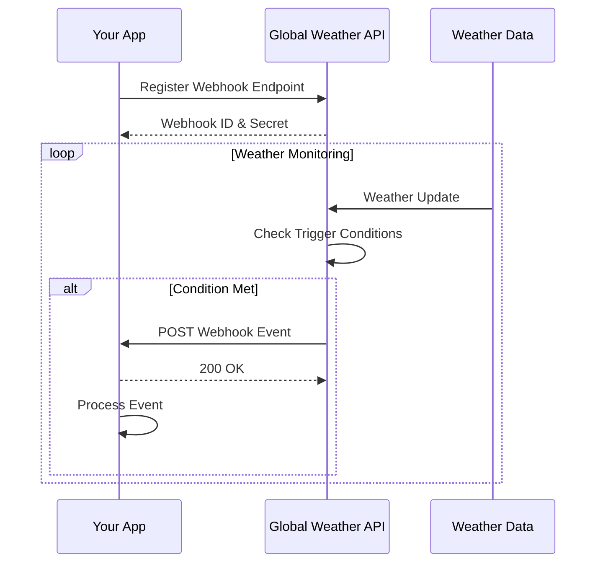

# Webhooks Guide

Real-time weather event notifications delivered directly to your application.

## Table of Contents

1. [Overview](#overview)
2. [How Webhooks Work](#how-webhooks-work)
3. [Setting Up Webhooks](#setting-up-webhooks)
4. [Event Types](#event-types)
5. [Webhook Security](#webhook-security)
6. [Payload Structure](#payload-structure)
7. [Handling Webhooks](#handling-webhooks)
8. [Testing Webhooks](#testing-webhooks)
9. [Best Practices](#best-practices)
10. [Troubleshooting](#troubleshooting)
11. [Examples](#examples)

## Overview

Webhooks allow your application to receive real-time notifications when weather events occur. Instead of constantly polling our API for updates, webhooks push data to your endpoint when specific conditions are met.

### Benefits of Webhooks

- **Real-time Updates**: Receive instant notifications
- **Reduced API Calls**: No need for constant polling
- **Event-Driven Architecture**: React to events as they happen
- **Customizable Triggers**: Define your own alert conditions
- **Reliability**: Automatic retries and delivery guarantees

### Common Use Cases

- Severe weather alerts for user locations
- Temperature threshold notifications
- Daily weather summaries
- Precipitation warnings
- Air quality alerts
- Custom business logic triggers

## How Webhooks Work



## Setting Up Webhooks

### Step 1: Create a Webhook Endpoint

First, create an endpoint in your application to receive webhook events:

```python
# Python (Flask)
from flask import Flask, request, jsonify
import hmac
import hashlib

app = Flask(__name__)
WEBHOOK_SECRET = 'your_webhook_secret'

@app.route('/webhooks/weather', methods=['POST'])
def handle_webhook():
    # Verify webhook signature
    signature = request.headers.get('X-Webhook-Signature')
    if not verify_signature(request.data, signature):
        return jsonify({'error': 'Invalid signature'}), 401
    
    # Process webhook event
    event = request.json
    event_type = event['event']
    
    if event_type == 'weather.alert.created':
        handle_weather_alert(event['data'])
    elif event_type == 'weather.threshold.exceeded':
        handle_threshold_exceeded(event['data'])
    
    return jsonify({'status': 'received'}), 200

def verify_signature(payload, signature):
    expected = hmac.new(
        WEBHOOK_SECRET.encode(),
        payload,
        hashlib.sha256
    ).hexdigest()
    return hmac.compare_digest(expected, signature)
```

```javascript
// Node.js (Express)
const express = require('express');
const crypto = require('crypto');

const app = express();
const WEBHOOK_SECRET = 'your_webhook_secret';

app.post('/webhooks/weather', express.raw({type: 'application/json'}), (req, res) => {
    // Verify webhook signature
    const signature = req.headers['x-webhook-signature'];
    if (!verifySignature(req.body, signature)) {
        return res.status(401).json({ error: 'Invalid signature' });
    }
    
    // Process webhook event
    const event = JSON.parse(req.body);
    
    switch(event.event) {
        case 'weather.alert.created':
            handleWeatherAlert(event.data);
            break;
        case 'weather.threshold.exceeded':
            handleThresholdExceeded(event.data);
            break;
    }
    
    res.status(200).json({ status: 'received' });
});

function verifySignature(payload, signature) {
    const expected = crypto
        .createHmac('sha256', WEBHOOK_SECRET)
        .update(payload)
        .digest('hex');
    return crypto.timingSafeEqual(
        Buffer.from(signature),
        Buffer.from(expected)
    );
}
```

### Step 2: Register Your Webhook

Register your endpoint with the Global Weather API:

```bash
curl -X POST "https://api.globalweather.com/v1/webhooks" \
  -H "Authorization: Bearer YOUR_API_KEY" \
  -H "Content-Type: application/json" \
  -d '{
    "url": "https://your-app.com/webhooks/weather",
    "events": [
      "weather.alert.created",
      "weather.threshold.exceeded"
    ],
    "description": "Production weather alerts",
    "active": true
  }'
```

**Response:**
```json
{
  "id": "webhook_abc123",
  "url": "https://your-app.com/webhooks/weather",
  "events": [
    "weather.alert.created",
    "weather.threshold.exceeded"
  ],
  "secret": "whsec_def456ghi789",
  "description": "Production weather alerts",
  "active": true,
  "created_at": "2025-01-01T12:00:00Z",
  "metadata": {
    "version": "1.0",
    "max_retries": 3,
    "timeout_seconds": 30
  }
}
```

### Step 3: Configure Event Triggers

Set up specific triggers for your webhooks:

```javascript
// Configure temperature threshold alert
const temperatureAlert = {
    webhook_id: 'webhook_abc123',
    trigger: {
        type: 'temperature_threshold',
        conditions: {
            temperature: {
                operator: 'greater_than',
                value: 35,
                unit: 'celsius'
            },
            locations: ['Los Angeles', 'Phoenix', 'Las Vegas'],
            duration_minutes: 60
        },
        notification: {
            cooldown_minutes: 120,
            include_forecast: true
        }
    }
};

// Configure severe weather alert
const severeWeatherAlert = {
    webhook_id: 'webhook_abc123',
    trigger: {
        type: 'severe_weather',
        conditions: {
            severity: ['severe', 'extreme'],
            types: ['hurricane', 'tornado', 'flood'],
            locations: 'all', // All user locations
            advance_warning_hours: 24
        }
    }
};

// Configure air quality alert
const airQualityAlert = {
    webhook_id: 'webhook_abc123',
    trigger: {
        type: 'air_quality',
        conditions: {
            aqi: {
                operator: 'greater_than',
                value: 100
            },
            locations: ['Beijing', 'Delhi', 'Los Angeles'],
            persistent_hours: 3
        }
    }
};
```

## Event Types

### Weather Events

| Event | Description | Trigger Conditions |
|-------|-------------|-------------------|
| `weather.alert.created` | New weather alert issued | Official weather service alert |
| `weather.alert.updated` | Existing alert modified | Alert severity or area changed |
| `weather.alert.cancelled` | Alert cancelled | Alert no longer active |
| `weather.conditions.changed` | Significant weather change | Temperature, precipitation, wind |

### Threshold Events

| Event | Description | Configurable Parameters |
|-------|-------------|------------------------|
| `weather.threshold.exceeded` | Custom threshold exceeded | Temperature, humidity, wind, etc. |
| `weather.threshold.recovered` | Returned to normal | Below threshold for duration |

### Forecast Events

| Event | Description | Use Case |
|-------|-------------|----------|
| `forecast.updated` | New forecast available | Daily forecast updates |
| `forecast.significant_change` | Major forecast change | Planning adjustments needed |

### System Events

| Event | Description | Action Required |
|-------|-------------|-----------------|
| `webhook.test` | Test event | Verify endpoint working |
| `webhook.disabled` | Webhook auto-disabled | Too many failures |

## Webhook Security

### Signature Verification

Every webhook includes a signature header for verification:

```python
import hmac
import hashlib
import time

class WebhookVerifier:
    def __init__(self, secret):
        self.secret = secret
    
    def verify(self, payload, signature_header):
        # Parse signature header
        # Format: "t=timestamp,v1=signature"
        elements = {}
        for element in signature_header.split(','):
            key, value = element.split('=')
            elements[key] = value
        
        # Verify timestamp (prevent replay attacks)
        timestamp = int(elements['t'])
        if abs(time.time() - timestamp) > 300:  # 5 minutes
            raise ValueError('Webhook timestamp too old')
        
        # Verify signature
        signed_payload = f"{timestamp}.{payload}"
        expected_signature = hmac.new(
            self.secret.encode(),
            signed_payload.encode(),
            hashlib.sha256
        ).hexdigest()
        
        if not hmac.compare_digest(elements['v1'], expected_signature):
            raise ValueError('Invalid webhook signature')
        
        return True
```

### IP Whitelisting

Webhooks are sent from these IP ranges:
```
Production:
- 52.89.214.238/32
- 34.212.75.30/32
- 54.218.53.128/32

Staging:
- 52.32.178.7/32
```

### HTTPS Requirements

- Webhooks are only sent to HTTPS endpoints
- TLS 1.2 or higher required
- Valid SSL certificate required
- Self-signed certificates not supported

## Payload Structure

### Standard Webhook Payload

```json
{
  "id": "evt_1234567890",
  "event": "weather.alert.created",
  "created": "2025-01-01T12:00:00Z",
  "api_version": "v1",
  "data": {
    // Event-specific data
  },
  "metadata": {
    "webhook_id": "webhook_abc123",
    "attempt": 1,
    "request_id": "req_xyz789"
  }
}
```

### Weather Alert Payload

```json
{
  "id": "evt_alert_123",
  "event": "weather.alert.created",
  "created": "2025-01-01T12:00:00Z",
  "data": {
    "alert": {
      "id": "NWS-2025-001",
      "type": "severe_thunderstorm_warning",
      "severity": "severe",
      "urgency": "immediate",
      "certainty": "observed",
      "title": "Severe Thunderstorm Warning",
      "description": "Severe thunderstorm warning in effect until 3:00 PM",
      "instructions": "Take shelter immediately in a substantial building",
      "areas": [
        {
          "name": "Dallas County",
          "geocode": "48113",
          "coordinates": {
            "lat": 32.7767,
            "lon": -96.7970
          }
        }
      ],
      "effective": "2025-01-01T12:00:00Z",
      "expires": "2025-01-01T15:00:00Z",
      "sender": "National Weather Service"
    },
    "affected_locations": [
      {
        "city": "Dallas",
        "state": "TX",
        "population": 1345000,
        "current_conditions": {
          "temperature": 28.5,
          "wind_speed": 45.2,
          "precipitation_rate": 25.4
        }
      }
    ]
  }
}
```

### Threshold Exceeded Payload

```json
{
  "id": "evt_threshold_456",
  "event": "weather.threshold.exceeded",
  "created": "2025-01-01T14:30:00Z",
  "data": {
    "trigger": {
      "id": "trigger_789",
      "name": "High Temperature Alert",
      "type": "temperature"
    },
    "threshold": {
      "parameter": "temperature",
      "operator": "greater_than",
      "value": 35,
      "unit": "celsius"
    },
    "measurement": {
      "value": 36.5,
      "unit": "celsius",
      "timestamp": "2025-01-01T14:25:00Z",
      "duration_exceeded_minutes": 65
    },
    "location": {
      "city": "Phoenix",
      "state": "AZ",
      "coordinates": {
        "lat": 33.4484,
        "lon": -112.0740
      }
    },
    "forecast": {
      "next_6_hours": {
        "max_temperature": 38.2,
        "min_temperature": 35.1
      }
    }
  }
}
```

## Handling Webhooks

### Webhook Handler Implementation

```python
# Comprehensive webhook handler
class WebhookHandler:
    def __init__(self, secret):
        self.secret = secret
        self.handlers = {
            'weather.alert.created': self.handle_alert_created,
            'weather.alert.updated': self.handle_alert_updated,
            'weather.alert.cancelled': self.handle_alert_cancelled,
            'weather.threshold.exceeded': self.handle_threshold_exceeded,
            'weather.threshold.recovered': self.handle_threshold_recovered
        }
    
    def process_webhook(self, headers, body):
        # Verify signature
        if not self.verify_signature(headers, body):
            raise SecurityError('Invalid webhook signature')
        
        # Parse event
        event = json.loads(body)
        event_type = event['event']
        
        # Check for duplicate
        if self.is_duplicate(event['id']):
            return {'status': 'duplicate'}
        
        # Store event ID
        self.store_event_id(event['id'])
        
        # Handle event
        handler = self.handlers.get(event_type)
        if handler:
            return handler(event['data'])
        else:
            return {'status': 'unhandled', 'event': event_type}
    
    def handle_alert_created(self, data):
        alert = data['alert']
        
        # Priority-based handling
        if alert['severity'] == 'extreme':
            self.send_immediate_notification(alert)
            self.trigger_emergency_protocol(alert)
        elif alert['severity'] == 'severe':
            self.send_push_notification(alert)
            self.update_dashboard(alert)
        else:
            self.queue_notification(alert)
        
        # Log alert
        self.log_alert(alert)
        
        # Update affected users
        self.notify_affected_users(data['affected_locations'])
        
        return {'status': 'processed', 'actions': ['notified', 'logged']}
    
    def handle_threshold_exceeded(self, data):
        trigger = data['trigger']
        measurement = data['measurement']
        location = data['location']
        
        # Business logic based on threshold type
        if trigger['type'] == 'temperature':
            self.handle_temperature_threshold(measurement, location)
        elif trigger['type'] == 'air_quality':
            self.handle_air_quality_threshold(measurement, location)
        
        # Update metrics
        self.update_metrics(trigger, measurement)
        
        # Check for escalation
        if measurement['duration_exceeded_minutes'] > 120:
            self.escalate_alert(trigger, measurement)
        
        return {'status': 'processed'}
    
    def send_immediate_notification(self, alert):
        # Send SMS
        for user in self.get_affected_users(alert['areas']):
            self.sms_service.send(
                to=user.phone,
                message=f"⚠️ {alert['title']}\n{alert['instructions']}"
            )
        
        # Send push notifications
        self.push_service.broadcast(
            title=alert['title'],
            body=alert['description'],
            data={'alert_id': alert['id']},
            priority='high'
        )
        
        # Send emails
        self.email_service.send_alert(alert)
```

### Asynchronous Processing

```javascript
// Node.js with message queue
const Queue = require('bull');
const webhookQueue = new Queue('webhook-processing');

app.post('/webhooks/weather', async (req, res) => {
    // Quickly acknowledge receipt
    res.status(200).json({ status: 'received' });
    
    // Queue for processing
    await webhookQueue.add('process-webhook', {
        headers: req.headers,
        body: req.body,
        timestamp: Date.now()
    });
});

// Worker process
webhookQueue.process('process-webhook', async (job) => {
    const { headers, body } = job.data;
    
    try {
        // Verify signature
        if (!verifySignature(body, headers['x-webhook-signature'])) {
            throw new Error('Invalid signature');
        }
        
        const event = JSON.parse(body);
        
        // Process based on event type
        switch(event.event) {
            case 'weather.alert.created':
                await processWeatherAlert(event.data);
                break;
            case 'weather.threshold.exceeded':
                await processThresholdExceeded(event.data);
                break;
        }
        
        // Mark as processed
        await markEventProcessed(event.id);
        
    } catch (error) {
        console.error('Webhook processing error:', error);
        throw error; // Will retry
    }
});

async function processWeatherAlert(data) {
    const alert = data.alert;
    
    // Store in database
    await db.alerts.create({
        external_id: alert.id,
        type: alert.type,
        severity: alert.severity,
        areas: alert.areas,
        expires: alert.expires
    });
    
    // Notify users
    const affectedUsers = await findAffectedUsers(alert.areas);
    
    for (const user of affectedUsers) {
        await notifyUser(user, alert);
    }
    
    // Update real-time dashboard
    await updateDashboard({
        type: 'alert',
        data: alert
    });
}
```

### Error Recovery

```python
class ResilientWebhookHandler:
    def __init__(self):
        self.retry_delays = [1, 5, 15, 60, 300]  # seconds
        
    async def handle_with_retry(self, event):
        attempt = 0
        last_error = None
        
        while attempt < len(self.retry_delays):
            try:
                return await self.process_event(event)
                
            except TemporaryError as e:
                last_error = e
                attempt += 1
                
                if attempt < len(self.retry_delays):
                    delay = self.retry_delays[attempt]
                    await asyncio.sleep(delay)
                    continue
                    
            except PermanentError as e:
                # Don't retry permanent errors
                await self.log_permanent_error(event, e)
                raise
        
        # Max retries exceeded
        await self.handle_max_retries(event, last_error)
        raise MaxRetriesExceeded(last_error)
    
    async def process_event(self, event):
        # Check dependencies
        if not await self.check_dependencies():
            raise TemporaryError("Dependencies unavailable")
        
        # Process event
        result = await self.execute_business_logic(event)
        
        # Verify success
        if not await self.verify_processing(result):
            raise TemporaryError("Processing verification failed")
        
        return result
```

## Testing Webhooks

### Local Testing with ngrok

```bash
# Install ngrok
npm install -g ngrok

# Start your local server
node webhook-server.js

# In another terminal, expose your local server
ngrok http 3000

# Use the ngrok URL for webhook registration
# https://abc123.ngrok.io/webhooks/weather
```

### Test Event Trigger

```bash
# Trigger a test webhook
curl -X POST "https://api.globalweather.com/v1/webhooks/webhook_abc123/test" \
  -H "Authorization: Bearer YOUR_API_KEY" \
  -H "Content-Type: application/json" \
  -d '{
    "event_type": "weather.alert.created",
    "data": {
      "custom": "test data"
    }
  }'
```

### Webhook Testing Tool

```javascript
// Webhook testing utility
class WebhookTester {
    constructor(webhookUrl, secret) {
        this.webhookUrl = webhookUrl;
        this.secret = secret;
    }
    
    async sendTestEvent(eventType, data) {
        const event = {
            id: `test_${Date.now()}`,
            event: eventType,
            created: new Date().toISOString(),
            api_version: 'v1',
            data: data,
            metadata: {
                webhook_id: 'test_webhook',
                attempt: 1,
                request_id: `test_req_${Date.now()}`
            }
        };
        
        const payload = JSON.stringify(event);
        const signature = this.generateSignature(payload);
        
        const response = await fetch(this.webhookUrl, {
            method: 'POST',
            headers: {
                'Content-Type': 'application/json',
                'X-Webhook-Signature': signature,
                'X-Webhook-ID': event.id
            },
            body: payload
        });
        
        return {
            status: response.status,
            body: await response.text(),
            headers: Object.fromEntries(response.headers)
        };
    }
    
    generateSignature(payload) {
        const timestamp = Math.floor(Date.now() / 1000);
        const signedPayload = `${timestamp}.${payload}`;
        const signature = crypto
            .createHmac('sha256', this.secret)
            .update(signedPayload)
            .digest('hex');
        
        return `t=${timestamp},v1=${signature}`;
    }
    
    async runTestSuite() {
        const tests = [
            {
                name: 'Weather Alert',
                event: 'weather.alert.created',
                data: this.generateAlertData()
            },
            {
                name: 'Threshold Exceeded',
                event: 'weather.threshold.exceeded',
                data: this.generateThresholdData()
            },
            {
                name: 'Invalid Signature',
                event: 'weather.alert.created',
                data: {},
                invalidSignature: true
            }
        ];
        
        const results = [];
        
        for (const test of tests) {
            console.log(`Running test: ${test.name}`);
            
            try {
                const result = await this.sendTestEvent(
                    test.event,
                    test.data
                );
                
                results.push({
                    test: test.name,
                    success: result.status === 200,
                    response: result
                });
                
            } catch (error) {
                results.push({
                    test: test.name,
                    success: false,
                    error: error.message
                });
            }
        }
        
        return results;
    }
}

// Usage
const tester = new WebhookTester(
    'http://localhost:3000/webhooks/weather',
    'test_secret'
);

tester.runTestSuite().then(results => {
    console.log('Test Results:', results);
});
```

## Best Practices

### 1. Idempotency

Ensure webhooks can be processed multiple times safely:

```python
class IdempotentWebhookHandler:
    def __init__(self):
        self.processed_events = set()  # Use Redis in production
        
    def handle_event(self, event):
        event_id = event['id']
        
        # Check if already processed
        if event_id in self.processed_events:
            return {'status': 'already_processed'}
        
        # Process event
        result = self.process(event)
        
        # Mark as processed
        self.processed_events.add(event_id)
        
        # Store with expiration (7 days)
        self.redis.setex(
            f"webhook:processed:{event_id}",
            604800,  # 7 days in seconds
            json.dumps({
                'processed_at': datetime.now().isoformat(),
                'result': result
            })
        )
        
        return result
```

### 2. Acknowledge Quickly

Return 200 OK immediately, process asynchronously:

```javascript
app.post('/webhooks/weather', (req, res) => {
    // Quick validation
    if (!req.headers['x-webhook-signature']) {
        return res.status(401).json({ error: 'Missing signature' });
    }
    
    // Acknowledge receipt
    res.status(200).json({ received: true });
    
    // Process asynchronously
    setImmediate(() => {
        processWebhook(req.headers, req.body)
            .catch(error => {
                console.error('Webhook processing error:', error);
                // Send to dead letter queue
                deadLetterQueue.add({
                    error: error.message,
                    webhook: req.body,
                    timestamp: Date.now()
                });
            });
    });
});
```

### 3. Implement Circuit Breaker

Protect against cascading failures:

```python
class CircuitBreaker:
    def __init__(self, failure_threshold=5, timeout=60):
        self.failure_threshold = failure_threshold
        self.timeout = timeout
        self.failures = 0
        self.last_failure_time = None
        self.state = 'closed'  # closed, open, half-open
        
    def call(self, func, *args, **kwargs):
        if self.state == 'open':
            if time.time() - self.last_failure_time > self.timeout:
                self.state = 'half-open'
            else:
                raise CircuitOpenError('Circuit breaker is open')
        
        try:
            result = func(*args, **kwargs)
            
            if self.state == 'half-open':
                self.state = 'closed'
                self.failures = 0
            
            return result
            
        except Exception as e:
            self.failures += 1
            self.last_failure_time = time.time()
            
            if self.failures >= self.failure_threshold:
                self.state = 'open'
                
            raise e
```

### 4. Monitor and Alert

Track webhook performance:

```python
class WebhookMonitor:
    def __init__(self):
        self.metrics = {
            'received': 0,
            'processed': 0,
            'failed': 0,
            'processing_time': []
        }
        
    def record_webhook(self, event_type, duration, success):
        self.metrics['received'] += 1
        
        if success:
            self.metrics['processed'] += 1
        else:
            self.metrics['failed'] += 1
        
        self.metrics['processing_time'].append(duration)
        
        # Check thresholds
        if self.metrics['failed'] > 10:
            self.alert('High webhook failure rate')
        
        if duration > 5000:  # 5 seconds
            self.alert(f'Slow webhook processing: {duration}ms')
        
        # Send to monitoring service
        self.send_metrics({
            'event_type': event_type,
            'duration': duration,
            'success': success,
            'timestamp': datetime.now().isoformat()
        })
```

### 5. Graceful Degradation

Handle webhook failures gracefully:

```javascript
class WebhookFallback {
    async processWithFallback(event) {
        try {
            // Primary processing
            return await this.primaryHandler(event);
            
        } catch (error) {
            console.error('Primary handler failed:', error);
            
            // Try fallback
            try {
                return await this.fallbackHandler(event);
                
            } catch (fallbackError) {
                console.error('Fallback failed:', fallbackError);
                
                // Store for manual processing
                await this.storeForManualReview(event, error);
                
                // Return degraded response
                return {
                    status: 'degraded',
                    message: 'Event stored for processing'
                };
            }
        }
    }
    
    async fallbackHandler(event) {
        // Simplified processing
        if (event.event === 'weather.alert.created') {
            // Just store alert, skip notifications
            await this.db.alerts.create(event.data.alert);
            return { status: 'stored' };
        }
    }
}
```

## Troubleshooting

### Common Issues

#### Webhooks Not Being Received

**Diagnosis Steps:**
1. Verify webhook is active in dashboard
2. Check endpoint URL is correct and accessible
3. Confirm SSL certificate is valid
4. Test with webhook testing tool
5. Check firewall/security group settings

**Solution:**
```bash
# Test endpoint accessibility
curl -X POST https://your-app.com/webhooks/weather \
  -H "Content-Type: application/json" \
  -d '{"test": true}'

# Check SSL certificate
openssl s_client -connect your-app.com:443 -servername your-app.com

# Verify DNS resolution
nslookup your-app.com
```

#### Signature Verification Failing

**Common Causes:**
- Wrong secret key
- Incorrect signature algorithm
- Body parsing modifying payload
- Character encoding issues

**Solution:**
```javascript
// Ensure raw body for signature verification
app.use('/webhooks/weather', 
  express.raw({ type: 'application/json' })
);

// Correct signature verification
function verifySignature(rawBody, signature) {
    const elements = signature.split(',')
        .reduce((acc, element) => {
            const [key, value] = element.split('=');
            acc[key] = value;
            return acc;
        }, {});
    
    const signedPayload = `${elements.t}.${rawBody}`;
    const expectedSignature = crypto
        .createHmac('sha256', WEBHOOK_SECRET)
        .update(signedPayload, 'utf8')
        .digest('hex');
    
    return crypto.timingSafeEqual(
        Buffer.from(elements.v1),
        Buffer.from(expectedSignature)
    );
}
```

#### Duplicate Events

**Prevention:**
```python
class DuplicateEventFilter:
    def __init__(self, redis_client):
        self.redis = redis_client
        
    def is_duplicate(self, event_id):
        key = f"webhook:event:{event_id}"
        
        # Try to set with NX (only if not exists)
        result = self.redis.set(
            key,
            datetime.now().isoformat(),
            nx=True,
            ex=86400  # 24 hour expiration
        )
        
        # Returns False if key already existed
        return not result
    
    def handle_event(self, event):
        if self.is_duplicate(event['id']):
            return {
                'status': 'duplicate',
                'message': f"Event {event['id']} already processed"
            }
        
        return self.process_event(event)
```

#### High Latency

**Optimization Strategies:**
1. Process asynchronously
2. Use connection pooling
3. Implement caching
4. Batch database operations
5. Use regional endpoints

```python
# Optimized webhook handler
class OptimizedWebhookHandler:
    def __init__(self):
        self.db_pool = create_connection_pool()
        self.cache = RedisCache()
        self.batch_processor = BatchProcessor()
        
    async def handle_webhook(self, event):
        # Quick acknowledgment
        acknowledgment = {'received': True}
        
        # Queue for batch processing
        await self.batch_processor.add(event)
        
        # Return immediately
        return acknowledgment
    
    async def process_batch(self):
        events = await self.batch_processor.get_batch(size=100)
        
        if not events:
            return
        
        # Process in parallel
        tasks = [self.process_event(event) for event in events]
        results = await asyncio.gather(*tasks, return_exceptions=True)
        
        # Batch database write
        await self.batch_write_results(results)
```

## Examples

### Complete Python Implementation

```python
# webhook_server.py
from flask import Flask, request, jsonify
import hmac
import hashlib
import json
import logging
from datetime import datetime
import redis
from functools import wraps

app = Flask(__name__)
logger = logging.getLogger(__name__)
redis_client = redis.StrictRedis(host='localhost', port=6379, db=0)

WEBHOOK_SECRET = 'whsec_your_secret_here'

def verify_webhook(f):
    @wraps(f)
    def decorated_function(*args, **kwargs):
        # Get signature header
        signature_header = request.headers.get('X-Webhook-Signature')
        if not signature_header:
            return jsonify({'error': 'Missing signature'}), 401
        
        # Verify signature
        try:
            verify_signature(request.data, signature_header)
        except ValueError as e:
            return jsonify({'error': str(e)}), 401
        
        return f(*args, **kwargs)
    
    return decorated_function

def verify_signature(payload, signature_header):
    elements = {}
    for element in signature_header.split(','):
        key, value = element.split('=')
        elements[key] = value
    
    # Verify timestamp
    timestamp = int(elements['t'])
    current_time = datetime.now().timestamp()
    if abs(current_time - timestamp) > 300:  # 5 minutes
        raise ValueError('Webhook timestamp too old')
    
    # Verify signature
    signed_payload = f"{timestamp}.{payload.decode('utf-8')}"
    expected_signature = hmac.new(
        WEBHOOK_SECRET.encode(),
        signed_payload.encode(),
        hashlib.sha256
    ).hexdigest()
    
    if not hmac.compare_digest(elements['v1'], expected_signature):
        raise ValueError('Invalid webhook signature')

@app.route('/webhooks/weather', methods=['POST'])
@verify_webhook
def handle_weather_webhook():
    event = request.json
    
    # Check for duplicate
    event_id = event['id']
    if redis_client.exists(f"webhook:processed:{event_id}"):
        return jsonify({'status': 'duplicate'}), 200
    
    # Mark as processed
    redis_client.setex(
        f"webhook:processed:{event_id}",
        86400,  # 24 hours
        json.dumps({'processed_at': datetime.now().isoformat()})
    )
    
    # Process event
    try:
        result = process_webhook_event(event)
        return jsonify(result), 200
    except Exception as e:
        logger.error(f"Error processing webhook: {e}")
        return jsonify({'error': 'Processing failed'}), 500

def process_webhook_event(event):
    event_type = event['event']
    data = event['data']
    
    handlers = {
        'weather.alert.created': handle_weather_alert,
        'weather.threshold.exceeded': handle_threshold_exceeded,
        'weather.conditions.changed': handle_conditions_changed
    }
    
    handler = handlers.get(event_type)
    if handler:
        return handler(data)
    else:
        logger.warning(f"Unhandled event type: {event_type}")
        return {'status': 'unhandled', 'event': event_type}

def handle_weather_alert(data):
    alert = data['alert']
    
    logger.info(f"Weather alert received: {alert['title']}")
    
    # Store alert
    store_alert(alert)
    
    # Notify users
    affected_users = find_affected_users(alert['areas'])
    for user in affected_users:
        send_alert_notification(user, alert)
    
    # Update dashboard
    update_dashboard_alert(alert)
    
    return {
        'status': 'processed',
        'alert_id': alert['id'],
        'users_notified': len(affected_users)
    }

def handle_threshold_exceeded(data):
    trigger = data['trigger']
    measurement = data['measurement']
    location = data['location']
    
    logger.info(f"Threshold exceeded: {trigger['name']} at {location['city']}")
    
    # Take action based on threshold type
    if trigger['type'] == 'temperature':
        if measurement['value'] > 40:  # Extreme heat
            send_heat_warning(location, measurement)
    elif trigger['type'] == 'air_quality':
        if measurement['value'] > 150:  # Unhealthy
            send_air_quality_alert(location, measurement)
    
    return {
        'status': 'processed',
        'trigger': trigger['name'],
        'action_taken': True
    }

if __name__ == '__main__':
    app.run(debug=False, port=5000)
```

### Complete Node.js Implementation

```javascript
// webhook-server.js
const express = require('express');
const crypto = require('crypto');
const Redis = require('ioredis');
const winston = require('winston');

const app = express();
const redis = new Redis();
const logger = winston.createLogger({
    level: 'info',
    format: winston.format.json(),
    transports: [
        new winston.transports.File({ filename: 'webhooks.log' })
    ]
});

const WEBHOOK_SECRET = process.env.WEBHOOK_SECRET || 'whsec_your_secret';
const PORT = process.env.PORT || 3000;

// Middleware to capture raw body
app.use('/webhooks/weather', 
    express.raw({ type: 'application/json' })
);

// Webhook endpoint
app.post('/webhooks/weather', async (req, res) => {
    try {
        // Verify signature
        const signature = req.headers['x-webhook-signature'];
        if (!verifySignature(req.body, signature)) {
            return res.status(401).json({ error: 'Invalid signature' });
        }
        
        // Parse event
        const event = JSON.parse(req.body);
        
        // Check for duplicate
        const isDuplicate = await checkDuplicate(event.id);
        if (isDuplicate) {
            return res.status(200).json({ status: 'duplicate' });
        }
        
        // Acknowledge receipt immediately
        res.status(200).json({ status: 'received' });
        
        // Process asynchronously
        processWebhookAsync(event).catch(error => {
            logger.error('Webhook processing failed:', error);
        });
        
    } catch (error) {
        logger.error('Webhook handler error:', error);
        res.status(500).json({ error: 'Internal server error' });
    }
});

function verifySignature(payload, signatureHeader) {
    if (!signatureHeader) return false;
    
    const elements = signatureHeader.split(',')
        .reduce((acc, element) => {
            const [key, value] = element.split('=');
            acc[key] = value;
            return acc;
        }, {});
    
    const timestamp = parseInt(elements.t);
    const currentTime = Math.floor(Date.now() / 1000);
    
    // Check timestamp (5 minute tolerance)
    if (Math.abs(currentTime - timestamp) > 300) {
        return false;
    }
    
    // Verify signature
    const signedPayload = `${timestamp}.${payload}`;
    const expectedSignature = crypto
        .createHmac('sha256', WEBHOOK_SECRET)
        .update(signedPayload)
        .digest('hex');
    
    return crypto.timingSafeEqual(
        Buffer.from(elements.v1 || ''),
        Buffer.from(expectedSignature)
    );
}

async function checkDuplicate(eventId) {
    const key = `webhook:processed:${eventId}`;
    const exists = await redis.exists(key);
    
    if (!exists) {
        // Mark as processed with 24 hour expiration
        await redis.setex(key, 86400, new Date().toISOString());
    }
    
    return exists;
}

async function processWebhookAsync(event) {
    logger.info(`Processing webhook event: ${event.event}`);
    
    const handlers = {
        'weather.alert.created': handleWeatherAlert,
        'weather.threshold.exceeded': handleThresholdExceeded,
        'weather.conditions.changed': handleConditionsChanged,
        'webhook.test': handleTestEvent
    };
    
    const handler = handlers[event.event];
    if (handler) {
        await handler(event.data);
    } else {
        logger.warn(`Unhandled event type: ${event.event}`);
    }
}

async function handleWeatherAlert(data) {
    const alert = data.alert;
    
    logger.info(`Weather alert: ${alert.title} (${alert.severity})`);
    
    // Store in database
    await storeAlert(alert);
    
    // Send notifications
    const affectedUsers = await findAffectedUsers(alert.areas);
    
    await Promise.all(
        affectedUsers.map(user => sendAlertNotification(user, alert))
    );
    
    // Update real-time dashboard
    await updateDashboard({
        type: 'alert',
        data: alert
    });
    
    logger.info(`Alert processed: ${affectedUsers.length} users notified`);
}

async function handleThresholdExceeded(data) {
    const { trigger, measurement, location } = data;
    
    logger.info(`Threshold exceeded: ${trigger.name} at ${location.city}`);
    
    // Take action based on threshold
    if (trigger.type === 'temperature' && measurement.value > 40) {
        await sendExtremeHeatWarning(location, measurement);
    } else if (trigger.type === 'air_quality' && measurement.value > 150) {
        await sendAirQualityAlert(location, measurement);
    }
    
    // Record metric
    await recordThresholdEvent(trigger, measurement, location);
}

// Helper functions (implement based on your needs)
async function storeAlert(alert) {
    // Store in your database
}

async function findAffectedUsers(areas) {
    // Find users in affected areas
    return [];
}

async function sendAlertNotification(user, alert) {
    // Send notification to user
}

async function updateDashboard(update) {
    // Update real-time dashboard
}

// Start server
app.listen(PORT, () => {
    logger.info(`Webhook server listening on port ${PORT}`);
});
```

## Summary

Webhooks provide a powerful way to receive real-time weather updates and alerts. By following the best practices and implementation examples in this guide, you can build a robust webhook integration that:

- Processes events reliably and securely
- Handles errors gracefully
- Scales with your application
- Provides real-time value to your users

For additional support, consult our [API Reference](../reference/) or contact our support team.